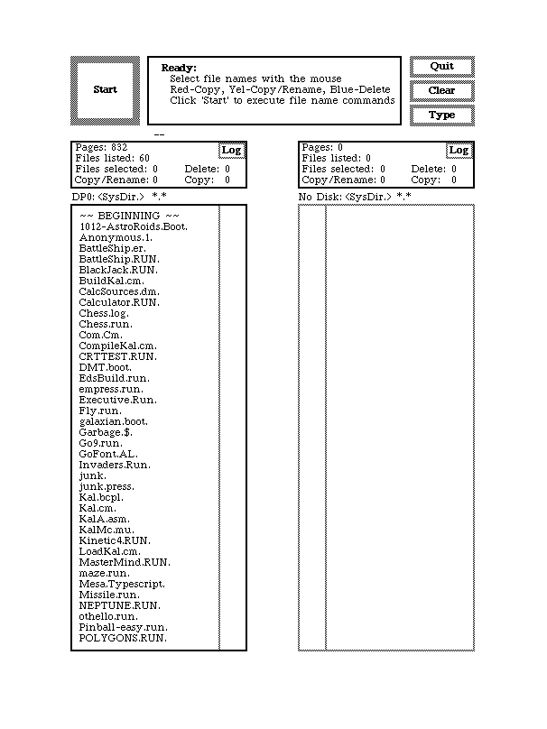

# HCI Technology History

计83李天勤2018080106

## Read and Watch Triumph of the Nerds and 硅谷海盗

### Sketch a timeline of how the GUI was developed... ie from Xerox Parc through IBM to Apple Macintosh to Windows

Timeline 

- 1973 - development of Xerox Alto by Xerox Parc 
- 1974 - development of Altair 8800 by MITS, widely recognized as the spark that ignited microcomputer recolution, created/invented by Ed Roberts. 
- 1975 - first PC was announced by Popular Electronics, Altair BASIC interpreter that ran on the MITS Altair 8800 written by Bill Gates and Paul Allen, Microsoft is formed
- 1976 - creation of Apple p.c by Steve Jobs and Steve Warzinak. Same year Apple 1 (containing just one circuit board) was released. 
- 1977 - creation of Apple 2 PC.
- 1979 - implementation of VisiCalc spreadhseet into Apple II, known as the first killer application.
- 1980 - Microsoft partners with IBM
- 1981 - creation of Xerox Star, Microsoft bought 86 DOS from Tim Patterson, renamed it to PC DOS, and licensed it to IBM for its own PC. 86 DOS is very similar to CP/M. 
- 1983 - introduction of Lisa by Apple, VisaCrop releases its first integrated sofware environment for IBM PCs, announcement of Windows software. Development of Lotus, the killer app for IBM PC. 
- 1984 - creation of Macintosh, became the first successful mass-marketed personal computer with a GUI
- 1985 - Microsoft Windows 1.0 is developed, came with a lot of different applitions
- 1992 - OS/2 Workplace released by IBM, Microsoft releases Windows 3.1
- 1995 - Microsoft releases Windows 95, soon becoming the most popular dekstop operating system,

### What features in the ALTO GUI are also familiar Windows or Apple system you see today

The first GUI to be used in an experimental form was Xerox's Alto workstation in 1972. Developed almost 12 years earlier than either Apple's original Macintosh and Microsoft's Windows, there are several similarties as well as differences. 

The Alto had all the basic components that GUI's today have. It was a cursor and windows based file system, with LAN functionality. It had a keyboard, supported text tables, buttons, and scrollbars, etc. It utilized bit-mapped displays instead of vector graphics. An example that I had found online is shown below. 

<!-- 

 -->
<figure align="center">

     <figcaption align="center">Alto running the Executive File Browser</figcaption>  
</figure>  

The starkest difference is that, the look and feel of today's GUIs are a lot more visually aesthetic compared to the black and white of the ALTO. Today's GUIs are full of color and have 3D sculptural effects. Since 1973, much of what we have added are simply eye candy. In the beggining, the Alto software, compared to Macintosh or Windows, was not desktop oriented and could instead be described as simply a system with various windows of mouse enabled graphical DOS software. 

A later version known as the Xerox Star would also advance the development of the GUI, despite never making profit from them. 

### What role did microsoft play through the development of the GUI?

After Jobs accused Bill of copying the Macintosh, Bill replied, 

> I think there's more than one way of looking at it. I think it's more like we both had this rich neighbor named Xerox, and I broke into his house to steal the TV set and found out that you had already stolen it. 

Although controversies still remain over how much of Microsoft's early GUI had been taken from Xerox, Apple, or the SCP, Microsoft had, and still has, a profound impact on the development of the GUI. Microsoft. It all started in 1975, when Popular Electronics covered the Altair 8800, arguable the world's first personal computer. Gates and Allen developed BASIC, an intepreter, for the Altair 8800. A dedicated intepreter for the Altair-8800 would lower the cost of these microcomputers and thus make it more appealing to the ordinary programmers. In the following year, Gates and Allen would found Microsoft, originally known as Micro-Soft.

Microsoft continued to aim to partner with the leading hardware companies, focusing on offering software, as it did with MITS. Microsoft was able to reach a similar agreement with IBM in 1980, who contracted them to create an operating system for the IBM PC. At that time, Microsoft's BASIC already had a large userbase, but it didn't have an Operating System. However, Gates was able to obtain QDOS, then repackaged it as MSDOS, and offered it to IBM. IBM PCs would soon control most of the market share, all of them running software controlled by Microsoft. Gates' and the Microsoft Culture to do anything to secure more market share was what made it so successful. Partnering with IBM would make Microsoft OS popular by default.

In Microsoft's early days, its philosophy of "a PC in every home" defined how it would approach its expansion. It pushed for quantity, often at the expensive of quality. Thus, Microsoft would create and dominate the personal computer software market. By 1983, Microsoft would release its Multi-Word processing Tool. It's WYSIWYG interface attracted even more users. The release of Windows 1.0 was a major step towards home computing as many users started to favor the GUI over the command-line interface. Over the next few years, the introduction of more compatable software such as Excel and word processors allowed Microsoft to capture a greater market. By 1985, Microsoft and IBM had another deal that allowed Microsoft to sell and license its OS to other companies. 

From then on, Microsoft continued to grow, and with each version (Windows 3, 95, etc), more functionality was added: different software, internet capabilities, etc.

Perhaps the most important contribution by Microsoft was Gate's unfaltering thirst for competition. Competition pushed not only Gates, but IBM and Apple to create more affortable, and usable personal computers that the public would buy.